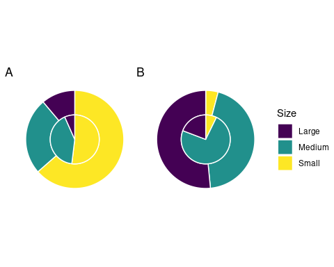
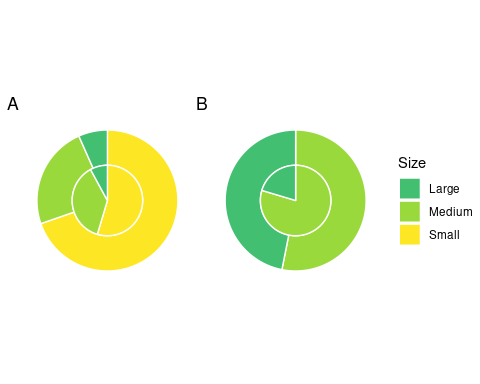
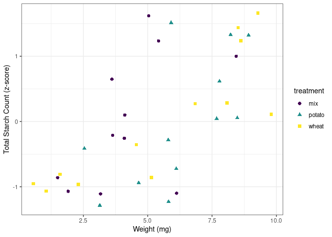
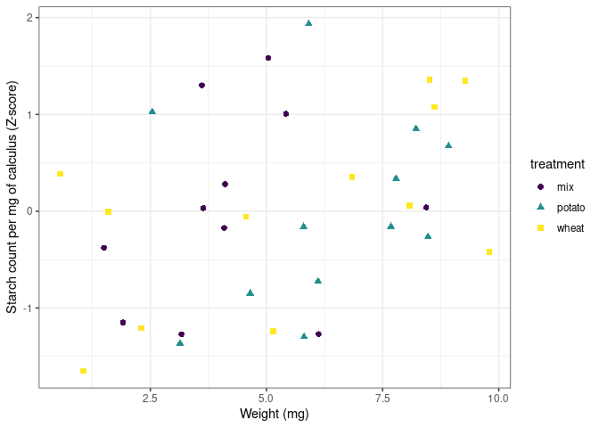

# Introduction

<!-- basic introduction to the field, comprehensible to a scientist in any discipline -->
<!-- Dental calculus is mineralised plaque. And it is pretty cool. -->
Dental calculus, mineralised dental plaque, has proven to contain a wealth of 
dietary information in the form of plant microfossils 
[@henryCalculusSyria2008; @hardyStarchGranulesDental2009], 
proteins [@hendyProteomicCalculus2018; @warinnerDirectEvidenceMilk2014],
and other organic residues [@buckleyDentalCalculusCooking2014]. 
It has also proven to be able to retain and preserve dietary information for millenea,
providing detailed dietary information on past populations 
[@henryCalculusSyria2008; @jovanovicNeolithicCalculus2021; @taoWheatCalculus2020] 
and species [@henryNeanderthalCalculus2014; @hardyNeanderthalMedics2012]. 

<!-- more detailed background, comprehensible to scientists in related disciplines -->
Until recently, few studies directly investigated the presence of plant microremains
in the dental calculus of archaeological remains. The ability to extract phytoliths
from the dental calculus of archaeological fauna to investigate diet was first 
noted by Armitage [-@armitageExtractionIdentificationOpal1975], 
and later by Middleton and Rovner [-@middletonExtractionOpalPhytoliths1994],
and Fox and colleagues [-@foxPhytolithCalculus1996]. The ability to detect coca
consumption by looking at human dental calculus was explored by Klepinger and Kuhn
[-@klepingerCalculusCoca1977], and starches and phytoliths were extracted from 
human dental calculus by Cummings and Magennis [-@cummingsMayanCalculus1997].

In more recent years, the study of dental calculus has increased exponentially, 
and the wealth of information contained within the mineralised matrix has been, 
to a larger extent, acknowledged. The applications of dental calculus span a wide
variety of archaeological research areas, such as oral microbiome 
characterisation (including pathogens) through the analysis of DNA and proteins 
[@adlerSequencingAncientCalcified2013; @warinnerPathogensHostImmunity2014],
microbotanical remains [@henryCalculusSyria2008; @hardyStarchGranulesDental2009;
@mickleburghNewInsightsConsumption2012], 
other organic residues and proteins from dietary compounds 
[@buckleyDentalCalculusCooking2014; @hendyProteomicCalculus2018], 
and nicotine-use [@eerkensDentalCalculusSource2018]. Especially the extraction 
of starch granules has become a rich source of dietary
information, as starch granules have proven to preserve well within dental calculus
over a variety of geographical and temporal ranges 
[@pipernoStarchGrains2008; @henryNeanderthalCalculus2014; @taoWheatCalculus2020;
@jovanovicNeolithicCalculus2021].

<!-- clearly stating the general problem being addressed by this particular study -->
<!-- Dental calculus research has its limitations, all of which I will solve with this
single method. -->
Despite this, our knowledge of dental calculus and the incorporation pathways of 
the various markers is limited [@radiniFoodMultiplePathways2017], as is our 
knowledge of information-loss caused by these pathways and the methods we use to 
extract and analyse dental calculus and make inferences on past diets. 
Extraction methods were tested 
by Tromp and colleagues [-@trompEDTACalculus2017], specifically regarding
decalcification using HCl or EDTA. 
The authors found significantly more starches with the EDTA extraction method 
than the HCl extraction method; however, as noted by the authors, comparisons 
involving archaeological calculus are problematic due to variability between and 
within individuals. Other studies have been conducted on modern populations 
[@leonardDentalCalculus2015] and primates [@powerChimpCalculus2015], both with
well-documented dietary intake, to reconcile our interpretations on the recovery 
of microremains (both phytoliths and starches) from dental calculus and how well
they represent actual dietary intake. These studies are justifiably limited, 
despite meticulous documentation and observation, due to unknown variables and 
uncertainty involved when studying living organisms. Dental calculus is a complex 
oral biofilm with a multifactorial aetiology and variable formation rates both 
within and between individuals [@jepsenCalculusRemoval2011], contributing to
the stochasticity of starch representation being observed in numerous studies.
Additionally, the rate of $\alpha$-amylase differs both between and within
individuals [@froehlichEffectOral1987; @naterHumanAmylase2005],
causing different rates of hydrolysis of the starch granules present in the oral
cavity. Add to this the effects of the many different methods
of starch processing, as well as post-depositional processes that are still being 
explored [@graneroStarchTaphonomy2020], and you have a highly unpredictable process.

In this exploratory study, we use an oral biofilm model to investigate the 
retention of starch granules within dental calculus in a controlled laboratory 
setting, allowing us full control over dietary input. We use a multiwell setup for consistent, high-throughout analysis.
Our main questions concern the representation of granules extracted
from the calculus compared to the actual intake. How much of the original diet is 
incorporated into the calculus, and how much is recovered? 
Is there differential loss of information from specific dietary markers that affects 
the obtained dietary information, and how does this affect the representation of 
diet from extracted microremains?  
We find that, despite an absence of $\alpha$-amylase in
the model, a limited proportion of the starch input is actually 
retained in the calculus, as well as a shift in the size ratios of individual 
starch granules
that are incoporated into the calculus. We also show that the number of starch
granules that are incorporated increases as the size of the calculus deposit 
increases.

# Materials and Methods

(\#fig:protocol-fig)Overview of experiment protocol

<!-- modify sampling days from protocol picture to match amylase sampling -->

## Biofilm formation

In this study we employ a multispecies oral biofilm model following a modified
protocol from Sissons and colleagues [-@sissonsMultistationDentalPlaque1991] and
Shellis [-@shellisSyntheticSalivaCultural1978]. The setup comprises a polypropylene 
24 deepwell PCR plate (KingFisher 97003510) with a lid containing 24 pegs (substrata), which 
is autoclaved at 120&deg;C, 1 bar overpressure, for 20 mins.
 
The artificial saliva (AS) is a modified version of the basal medium mucin (BMM)
described by Sissons and colleagues [-@sissonsMultistationDentalPlaque1991]. 
It contains 2.5 g/l partially purified mucin from porcine stomach (Type III, Sigma M1778), 
5 g/l trypticase peptone (Roth 2363.1), 10 g/l proteose peptone (Oxoid LP0085),
5 g/l yeast extract (BD 211921), 2.5 g/l KCl, 0.35 g/l NaCl, 1.8 mmol/l CaCl~2~, 
5.2 mmol/l Na~2~HPO~4~ [@sissonsMultistationDentalPlaque1991], 6.4 mmol/l NaHCO~3~ 
[@shellisSyntheticSalivaCultural1978], 2.5 mg/l haemin. This is subsequently 
adjusted to pH 7 with NaOH pellets and stirring, autoclaved (15 min, 120&deg;C, 
1 bar overpressure), and supplemented with 5.8 $\mu$mol/l menadione, 5 mmol/l urea, 
and 1 mmol/l arginine [@sissonsMultistationDentalPlaque1991].

<!-- add to protocols.io -->
Fresh whole saliva (WS) for inoculation was provided by a 31-year-old<!--needless to say I am much older now...--> male donor 
with no history of caries, who abstained from oral hygiene for 24 hours, and no 
food was consumed two hours prior to donation. No antibiotics were taken up to six 
months prior to donation. 
The saliva was filtered through a sterilised (with bleach) nylon cloth to remove
particulates.
Substrata were inoculated with 1 ml/well of a two-fold dilution of WS in sterilised 
20% (v/v) glycerine for four hours at 36&deg;C, to allow attachment of the
salivary pellicle and plaque-forming bacteria. After initial inoculation, the 
substrata were transferred to a new plate containing 1 ml/well AS and incubated 
at 36&deg;C, 30 rpm. The inoculation process was repeated on days 3 and 5. 
AS was partially refreshed once per day and fully refreshed every three days, 
throughout the experiment, by transferring the substrata to a new plate containing 
stock AS. To feed the bacteria, the substrata were transferred to a new plate, containing 
5% (w/v) sucrose, for six minutes twice daily, except on inoculation days 
(days 0, 3, and 5), where the samples only received one sucrose treatment after
inoculation. 

Starch treatments were initiated on day 9 to avoid starch granule counts being 
affected by $\alpha$-amylase hydrolysis. An $\alpha$-amylase (EC 3.2.1.1) activity
assay was conducted to confirm that no amylase was present in the system before
starch treatments started. Starch treatments replaced sucrose treatments, occurring twice per day
for six minutes. The starch treatments involved transferring the substrata to a 
new plate containing a 0.25% (w/v) starch from potato (Roth 9441.1) solution, a 0.25% (w/v) starch from wheat (Sigma S5127) solution, and a 0.5% (w/v) mixture of equal
concentrations (w/v) wheat and potato. All starch solutions were created in a 5%
(w/v) sucrose solution. Before transferring biofilm samples to the starch treatment plate, 
the plates were agitated to keep the starches in suspension in the solutions. 
During treatments, the rpm was increased to 60 to facilitate contact between
starch granules and biofilms.

After 15 days, mineralisation was encouraged with a 
calcium phosphate monofluorophosphate urea (CPMU) solution containing 
20 mmol/l CaCl~2~, 12 mmol/l NaH~2~PO~4~, 5 mmol/l Na~2~PO~3~F, 500 mmol/l Urea, 
and (0.04 g/l MgCl)
[@pearceConcomitantDepositionStrontium1987; @sissonsMultistationDentalPlaque1991].
The substrata were submerged in 1 ml/well CPMU for six minutes, five times 
daily, in a two-hour cycle. During the mineralisation period, starch treatments
were reduced to once per day after the five CPMU treatments. This process was repeated 
for 10 days until the end of the experiment on day 24 
(see \@ref(fig:protocol-fig) for an overview of the protocol). More detailed protocols
are available on protocols.io<!--insert DOI-->.

All laboratory work was conducted in sterile conditions under a laminar flow hood 
to prevent starch and bacterial contamination. Control samples that only received
sucrose as a treatment, were included to detect starch contamination from the
environment, or cross-contamination from other wells in the same plate.

## Amylase activity detection

An $\alpha$-amylase (EC 3.2.1.1) activity assay was conducted on artificial
saliva samples collected from the plate wells on days 3, 5, 6, 9, and 12. 
Whole saliva samples were collected on days 0, 3, and 5 as positive controls.
Collected samples were stored at 4&deg;C until the assay was conducted on day 18. 
All samples and standard curves were run in triplicates on two separate plates.
Positive control saliva samples were compared against a standard curve containing 
H~2~O, while artificial saliva samples were compared against a standard curve
containing sterile artificial saliva (due to the colour of artificial saliva).
Two photometric readings were conducted for each plate with a 540 nm filter on a... 
<!-- photometric reader specs -->
The protocol is a slightly modified version of an Enzymatic Assay of $\alpha$-Amylase
(https://www.sigmaaldrich.com/NL/en/technical-documents/protocol/protein-biology/enzyme-activity-assays/enzymatic-assay-of-a-amylase) [@bernfeldAmylase1955], which measures the amount of 
maltose released from starch by $\alpha$-amylase activity. Results are reported
in units (U) per mL enzyme, where 1 U releases 1 mg of maltose.
For a more detailed protocol, see <!-- protocols.io DOI -->

## Starch counts

Starch granule counts were divided into three size categories: small (<10 $\mu$m),
medium (10 -- 20 $\mu$m), and large (>20 $\mu$m). Counts for small wheat and
potato starches were combined for the mixed-treatment samples, as it was not 
possible to distinguish betweem the small starch granules from the two species.

### Treatment solutions

A 1 ml aliquot of each starch solution was taken, from which 10 $\mu$l was mounted 
on a microscope slide with an 18 x 18 mm coverslip, and counted under a light microscope
(Zeiss Axioscope A1). Counting starches on a full slide was not feasible, so three slide transects were 
counted (at ca. 1/4, 1/2, and 3/4 of the slide), and the sample counts were extrapolated 
(see Supplementary material for more details).

### Extraction method

Extraction of starches from the calculus samples was performed by dissolving the
calculus in ethylenediaminetetraacetic acid (EDTA) 
[@trompEDTACalculus2017; @lemoyneCalculusPretreatments2021; @modiCalculusMethodologies2020], 
and vortexing for 3 days until the sample was completely dissolved. 
Twenty $\mu$l of sample was mounted onto a slide with an 18x18 mm coverslip.
When transferring the sample to the slide, the sample was homogenised using 
the pipette to ensure that the counted transects were representative of the 
whole slide. Wheat and mix counts were extrapolated as described above.

## Statistical analysis

Statistical analysis was conducted in R version 4.1.1 (2021-08-10)  [@R-base].
<!-- R packages used -->
A one-way ANOVA with sample weight as the dependent variable (DV) and treatment 
as the grouping variable (GV) was conducted to explore the effect of the different 
starch treatments on biofilm growth.

To calculate size proportions, mean counts for each treatment were taken across 
both experimental plates for each treatment, resulting in a mean count for each
granule size category within each treatment.

Pearson's r was conducted on sample weight and total starch count, as well as sample
weight and starch count per mg calculus. The total count for each sample within a
treatment was standardised by z-score to account for the differences in magnitude
between the potato and wheat counts.
This was applied to total biofilm weight and starch count per mg 
calculus (also z-score standardised) to account for differences in starch 
concentration in the calculus [as per 
@wesolowskiEvaluatingMicrofossilContent2010].

All scripts and data used in the analysis are available on OSF 
(https://osf.io/uc5qy/) and Github (https://github.com/bbartholdy/byoc-starch).
All protocols are available on protocols.io.

# Results

All samples yielded sufficient biofilm growth and starch incorporation to be 
included in the analysis, resulting in a total of 48 biofilm samples (two plates of 24),
45 of which were used for analysis (three samples were set aside for later
 analysis).
Most control samples contained no starch granules, while some contained negligible
quantities (see Supplementary Material).

## No amylase activity detected in the model

Table: (\#tab:amylase-activity-tbl)Amylase activity in U/mL enzyme, where a U is mg maltose released from starch in six minutes at 36 degrees Celsius. Plate 1, photometric reading 1. Negative values converted to 0.

|    |     1|    2|    3|
|:---|-----:|----:|----:|
|S1  |  9.66| 3.44| 9.74|
|S2  | 10.30| 4.75| 9.61|
|S3  |  9.19| 5.15| 9.67|
|B1  |  0.00| 0.00| 0.00|
|B2  |  0.00| 0.00| 0.00|
|B3  |  0.00| 0.00| 0.00|
|B4  |  0.00| 0.00| 0.00|
|B5  |  0.00| 0.00| 0.00|
|BT1 |  0.00| 0.00| 0.00|
|BT2 |  0.00| 0.00| 0.00|
|BT3 |  0.00| 0.00| 0.00|

No appreciable amount of $\alpha$-amylase activity was detected in any of the artificial
saliva samples from any of the days that were sampled. Only positive controls
contained amylase activity that could be detected in the assay (Table
\@ref(tab:amylase-activity-tbl)). The results from the additional plates and
photometric readings can be found in the 
[Supplementary Materials](../supplementary-materials/supp-mat.Rmd). The results
are not comparable to other studies presenting $\alpha$-amylase activity levels
in humans; however, they are sufficient to show that there is no activity in the
system.

## Treatment type had no effect on biofilm growth

Table: (\#tab:anova-tbl)Summary statistics for biofilm dry-weights (in mg) by treatment.

|Treatment | Mean|   SD|  Min|   Max|
|:---------|----:|----:|----:|-----:|
|control   | 5.44| 2.45| 1.67| 11.20|
|mix       | 4.28| 1.95| 1.50|  8.44|
|potato    | 6.25| 2.07| 2.54|  8.92|
|wheat     | 5.53| 3.45| 0.56|  9.80|

A one-way ANOVA suggests that the type of starch used during the biofilm 
growth period had a minimal effect on the growth of the biofilm 
(expressed as total dry weight of the sample), F(3, 43)
= 1.16, p = 0.335. 
A summary of sample weights is available in Table \@ref(tab:anova-tbl).

## Starch counts

<!-- starch counts in the solutions -->

<!-- INSERT PICTURES OF STARCHES -->

Table: (\#tab:solution-count-tbl)Mean starch counts from solutions, including the
             proportional makeup of the different sizes of granules.

|Solution |Starch |Small (%)        |Medium (%)      |Large (%)       |Total (%)         |
|:--------|:------|:----------------|:---------------|:---------------|:-----------------|
|mix      |potato |NaN (NA)         |1051733 (53.1%) |928000 (46.9%)  |1979733 (100.0%)  |
|mix      |wheat  |18838400 (69.7%) |6403200 (23.7%) |1794133 (6.6%)  |27035733 (100.0%) |
|mix      |both   |18838400 (64.9%) |7454933 (25.7%) |2722133 (9.4%)  |29015467 (100.0%) |
|potato   |potato |123733 (4.1%)    |1337867 (44.4%) |1554400 (51.5%) |3016000 (100.0%)  |
|wheat    |wheat  |16139467 (63.5%) |6434133 (25.3%) |2830400 (11.1%) |25404000 (100.0%) |

<!-- starch counts in the samples -->

Table: (\#tab:sample-count-tbl)Mean starch counts extracted from samples with standard 
             deviation (SD), including the proportion of granule sizes of the total count.

|Treatment |Starch |Small (%)      |    SD|Medium (%)    |    SD|Large (%)    |   SD|Total (%)    |    SD|
|:---------|:------|:--------------|-----:|:-------------|-----:|:------------|----:|:------------|-----:|
|mix       |potato |NaN (NA)       |    NA|1959 (79.6%)  |  1800|501 (20.40%) |  446|2460 (100%)  |  2190|
|mix       |wheat  |9515 (54.60%)  |  8860|6522 (37.4%)  |  6030|1381 (7.93%) | 1200|17417 (100%) | 15900|
|mix       |both   |9515 (47.90%)  |  8860|8480 (42.7%)  |  7650|1882 (9.47%) | 1600|19877 (100%) | 17800|
|potato    |potato |351 (7.24%)    |   297|3565 (73.6%)  |  2400|930 (19.20%) |  929|4846 (100%)  |  3320|
|wheat     |wheat  |15235 (55.00%) | 11900|12148 (43.9%) | 11100|1953 (7.06%) | 2020|27680 (100%) | 23600|

It was not possible to differentiate between potato and 
wheat starches smaller than ca. 10 $\mu$m,
small potato starches were counted as wheat starches in the mixed-treatment samples. This is reasonable given that the small potato granules make up an insignificant proportion of the 
total count of small granules within mixed-treatment solutions, which are predominantly
wheat granules
(99.2%).
<!-- count of small granules from wheat solution divided by the sum of small granules 
from the potato and wheat solutions -->

<!-- absolute solution counts compared to absolute sample counts. does exposure
to higher quantities of starches mean more incorporated starches? -->
The separate wheat and potato solutions were made with a 0.25% (w/v) starch
concentration, while the mixed-starch solution was made with 0.25% (w/v) of each
starch, with a total concentration of 0.50% (w/v).
The mixed treatment had the highest absolute count of starch granules in solution (mean = 1.9797333\times 10^{6}, 2.7035733\times 10^{7}),
while the biofilms exposed to the wheat solution preserved the greatest number of
granules 
(mean = 2.7679545\times 10^{4}). 
The potato treatment had the lowest absolute counts in both the solution 
(3.016\times 10^{6})
and in the biofilm samples 
(4845.9090909) 
(Tables \@ref(tab:solution-count-tbl) and \@ref(tab:sample-count-tbl)).

<!-- look at proportions of incorporated starches in each sample before looking at overall means -->

### Proportion of available starches incorporated in samples

Table: (\#tab:sample-prop-tbl)The mean percentage of starches from the solutions that 
              were incorported into the samples.

|Treatment |Starch |Small  |Medium |Large  |Total  |
|:---------|:------|:------|:------|:------|:------|
|mix       |potato |NA     |0.186% |0.054% |0.124% |
|mix       |wheat  |0.051% |0.102% |0.077% |0.064% |
|mix       |both   |0.051% |0.114% |0.069% |0.069% |
|potato    |potato |0.284% |0.266% |0.060% |0.161% |
|wheat     |wheat  |0.094% |0.189% |0.069% |0.109% |

The proportion of total starches from the solutions that were incorporated 
into the samples ranged from 
0.064% to 0.161%,
with potato granules being more readily incorporated than wheat in both the
separated- and mixed-treatment samples
(Table \@ref(tab:sample-prop-tbl)). 
There is an inverse relationship between the absolute starch count in the solutions 
and the proportional incorporation of starches in the biofilm samples, i.e. potato 
had the lowest absolute count in solutions, but the highest proportional 
incorporation, and vice versa for the mixed treatment.

<!-- separated treatments -->

<!-- mixed treatments -->
Wheat incorporation was most affected in the mixed-treatment samples, with only
0.064% of the total available starches being incorporated into
the sample, compared to
0.161%
in the separated wheat treatment.

### Size ratios differ between solutions and samples

<!-- size proportions -->
<!-- pie charts -->

(\#fig:sep-plot)(A) Proportion (%) of sizes of starch granules in the wheat solution (outer ring) and extracted from the wheat-treatment samples (inner ring), and (B) in the potato solution (outer ring) and extracted from the potato-treatment samples (inner ring). l = large, m = medium, s = small.

<!-- change colour of medium starches in D to match C -->

(\#fig:mix-plot)Proportion of sizes of (A) wheat granules in the mixed solution (outer ring) and extracted from the wheat-treatment samples (inner ring), and sizes of (B) potato granules in the solution (outer ring) and extracted from the potato-treatment samples (inner ring). l = large, m = medium, s = small.

<!-- Combine to a single figure? -->

<!-- overall size trends -->

Overall, medium starch granules had a higher mean rate of incorporation 
(0.186%) 
than small 
(0.143%) 
and large 
(0.065%) 
starch granules across all treatments, while large potato starches had the lowest 
rate of incorporation across all treatments.

<!-- separated and mixed treatments -->
The difference in incorporation between the size categories resulted in a change
in size ratios between the original starch solutions and the extracted samples.
Large potato granules (> 20 $\mu$m) were most affected, with a 
32.3% 
decrease in relative abundance in the potato-only treatment, and a
26.5% 
decrease in mixed treatments. Medium granules increased in relative abundance 
across all samples, while small granules decreased in wheat treatments and 
increased in potato treatments 
(Figures \@ref(fig:sep-plot) and \@ref(fig:mix-plot)). 

<!-- Chi square test for size counts? -->

<!-- Proportion and size ratios are the most important points to be made -->

### Biofilm weight correlated positively with extracted starch counts

(\#fig:cor-plot)Scatter plot of sample weight and standardised starch count by Z-score for seprated treatments.

<!-- with Z-score standardisation -->

Pearson's *r* suggests a 
strong positive 
correlation between the total weight of the biofilms and the total starch count 
(standardised by z-score) extracted from the samples across treatments, 
*r* = 0.659, 
90%CI[0.463, 0.794],
p = < 0.001
(Figure \@ref(fig:cor-plot)). 

The same test was applied to total biofilm weight and starch count per mg 
calculus (also standardised by z-score), resulting in a weak positive correlation, 
*r* = 0.3, 
90%CI[0.0618, 0.506],
p 0.0403
(Figure \@ref(fig:cor-plot2)).

<!-- size ratios in the larger deposits vs the smaller deposits?
  Are larger starches more proportionately represented in larger deposits?
  -->
  

(\#fig:cor-plot2)Scatter plot of sample weight in mg and standardised count of starch grains per mg calculus.

# Discussion

<!-- Big summary/important statement for the science -->
Here, we have provided a method for exploring the incorporation of dietary 
starches into the mineral matrix of a dental calculus biofilm model. Our results show
that a very low proportion of the starches exposed to the biofilm during growth are
retained in the mineral matrix, and that the size of the starch granules
may affect the likeliness of incorporation. The proportions of starch granules 
(of all sizes) present in the extracted samples were similar across all treatments
(0.064% to 0.161%), 
despite large differences in absolute granule counts between wheat 
(25,404,000) 
and potato
(3,016,000)
solutions.  
The absolute counts, however, differed more visibly between treatments and was
proportional with the total count of granules in the treatment solutions. Wheat 
and mixed solutions had the highest absolute mean count of starch granules, and 
also had the highest absolute mean count of starch granules extracted from the 
dental calculus
(Tables \@ref(tab:solution-count-tbl) and \@ref(tab:sample-count-tbl)).
This suggests that the starches that are more frequently consumed will be present
in higher quantities in the dental calculus, at least prior to inhumation and 
degradation in the burial environment; although, starch availability is unlikely
to be a main factor in starch incorporation. 
Despite the low proportion of granules recovered from the model calculus 
(0.064% to 0.161%),
the absolute counts were still substantially greater than counts recovered from 
archaeological remains 
[@trompDietaryNondietary2015; @trompEDTACalculus2017; @wesolowskiEvaluatingMicrofossilContent2010].

<!--
Given the low proportion of starch granule retention in our dental calculus model,
and the limited difference between treatments, we can conjecture that starch 
availability is not a main factor in starch incorporation. While there was a
proportional incorporation, i.e. more granules in the solution led to more granules
in the calculus, the difference between solutions [a number/percentage] was of a
higher magnitude than the difference between samples <!-- a number/percentage-->

<!-- although this study extrapolated counts to full sample content, which is
rarely done in archaeological studies-->

<!-- Scientific findings as extension of previous work -->
Previous research conducted on dental calculus from contemporary humans and non-human
primates suggest a high level of stochasticity involved in the retention of 
starch granules in dental calculus, and that starch granules extracted from dental 
calculus are underrepresented with regard
to actual starch intake, which is consistent with our findings (illustrated by high
standard deviations and low proportional incorporation).
Leonard and colleagues [-@leonardDentalCalculus2015] found individual
calculus samples to be a poor predictor of diet in a population, as many of the 
consumed plants were missing from some individual samples, but were present in others.   
Power and colleagues [-@powerChimpCalculus2015] 
presented similar findings in non-human primates, where phytoliths were more
representative of individual diets than starch granules, and plants that 
produce predominantly larger starch (10-20 $\mu$m) granules were over-represented.
Both studies concluded that the dietary breadth of a population can
be captured in a sufficiently large sample, but interpretations on individual diets
from microremains in dental calculus is tenuous, at best 
[@leonardDentalCalculus2015; @powerChimpCalculus2015].

<!-- secondary findings -->

We have also shown that the size of the starch granules influences the likelihood
of incorporation into the calculus. Starch granules larger than 20 $\mu$m in 
diameter were underrepresented in the calculus samples compared to the original 
starch solutions, an effect that was consistent across all three treatments, 
while medium granules (10 -- 20 $\mu$m) were often over-represented
(Table \@ref(tab:sample-prop-tbl), 
and Figures \@ref(fig:sep-plot) and \@ref(fig:mix-plot)).
This was especially true for the potato starches, which can reach up to 100 $\mu$m
in diameter, whereas wheat generally only reach up to 35 $\mu$m 
[@gismondiStarchGranulesData2019; @haslamDecompositionStarch2004].
This is consistent with the findings by Power and collagues [-@powerChimpCalculus2015]
mentioned previously, which found that the large (defined as medium in this study) 
granule-producing plants were overrepresented; although, the representation of granules 
larger than 20 $\mu$m in that study is unclear. Since those results were obtained
on a modern population of chimps that were only buried for a short period of time, 
degradation was likely limited [@powerChimpCalculus2015]. The taphonomy of
starch granules has been addressed previously, and depends on burial environment
(pH, temperature, microorganisms), as well as processing of the granules prior to
deposition [@henryCookingStarch2009; @graneroStarchTaphonomy2020; @haslamDecompositionStarch2004]. 
The potential for detrimental diagenetic effects on starch granules increases as 
the size and amylose content decreases
[@francoStarchDegradation1992; @haslamDecompositionStarch2004]. 
Combined, the effect of intra-oral starch incorporation
and the bias against large granules, together with the increased effect of taphonomy
on  small granules, would eliminate a large portion of the consumed starch granules,
and could explain the large descrepency between our counts (unaffected by hydrolysis and taphonomy) and the aforementioned studies.  
Another potentially important factor from our results is the size of the calculus
deposit, which seems to influence the quantity of 
starches extracted from the calculus, as we found a strong positive correlation
between biofilm size and retained starch granules
(Figure \@ref(fig:cor-plot)); a result that contradicts findings from archaeological contexts
[@wesolowskiEvaluatingMicrofossilContent2010; @dudgeonDietGeographyDrinking2014]. 
When the concentration of starch granules
per mg calculus is considered, the correlation is weaker, but still present
(Figure \@ref(fig:cor-plot2));
while the larger deposits contain a higher absolute count, our findings also suggest
that they contain a slightly higher concentration of starches. 
The lack of a correlation
in archaeological contexts could be due to diagenetic effects; or, the absence of 
amylase activity in our study could be impacting our interpretations.

<!-- How are starch granules trapped in dental calculus? Does anyone actually know? -->

The mechanism by which starch granules are incorporated into plaque and calculus 
remains largely unknown, and few studies have directly investigated potential
mechanisms. We know that a proportion of the starch granules entering 
the mouth can become trapped in the plaque/calculus, and can be recovered from
archaeological samples of significant age 
[@henryNeanderthalCalculus2014; @buckleyDentalCalculusCooking2014; @wuDietEarliest2021]. 
Studies have also shown that not all starch granules come from a dietary source. 
Other pathways include cross-contamination from plant interactions in soil, such 
as palm phytoliths adhering to the skin of sweet potatoes 
[@trompDietaryNondietary2015], 
or accidental ingestion not related to food consumption 
[@radiniFoodMultiplePathways2017; @radiniMedievalWomenEarly2019].  
When starch granules enter the mouth, whether through ingestion of food or accidental
intake, they immediately encounter multiple obstacles. It is likely
that the bulk of starch granules are swallowed along with the food, and are 
only briefly present in the oral cavity. Other granules that are broken off
during mastication may be retained in the dentition. These granules are then
susceptible to mechanical removal by the tongue, salivary clearance, and hydrolysis
by $\alpha$-amylase [@kashketFoodParticles1996].
Starch granules that are trapped in crevices and channels on the surface of the
mineralised plaque are (at least to some extent) protected from salivary
clearance and mechanical cleaning actions of the tongue and lips, especially once
a new layer of plaque has covered the surface of the calculus. This may explain 
why a previous study found starches more commonly in clusters, rather than 
dispersed over the surface of the dental calculus [@powerSEMCalculus2014]. 
The authors hypothesised that the granules are either deposited in clusters, or 
group together in cracks and
crevices within the mineral matrix. Unmineralised Lacunae and channels within the 
calculus matrix have been shown to contain viable
bacteria, and may also be large enough to contain starch granules. These can 
range from the width of a single cell, to multiple-cell
width [@tanCalculusUltrastructure2004], of which the latter could feasibly contain 
starch granules. 
If this is indeed one of the incorporation mechanisms of starch granules, then the 
limit of incorporated starches is set by the number and size of channels. Since 
this is likely controlled by the size of the calculus deposit, then the number of 
starches will increase as the size of the biofilm increases, which is consistent 
with our results 
(Figures \@ref(fig:cor-plot1) and \@ref(fig:cor-plot2)).
The size bias against large granules (>20 $\mu$m) may give further credence to the 
incorporation pathway of starch granules primarily in cracks and crevices in the 
calculus, as the smaller starch granules have an advantage over larger granules, 
and can be stored in larger quantities.  
While potentially protected against clearance, granules trapped 
in plaque/calculus may still be susceptible to hydrolysis, as $\alpha$-amylase has
the ability to bind to both tooth enamel and bacteria within a biofilm and retain
a portion of its hydrolytic activity
[@scannapiecoSalivaryAmylase1993; @nikitkovaStarchBiofilms2013; @tanStudyBacterialViability2004; @tanCalculusUltrastructure2004].
The susceptibility of granules to hydrolysis depends on the crystallinity and size
of the starch granule, as well as the mode of processing. As mentioned previously,
smaller starch granules are more susceptible to enzymatic degradation, as are 
pre-processed starches (e.g. by cooking), while dehydrated starches will have a
reduced susceptibility
[@lingstromStarchyFood1994; @francoStarchDegradation1992; @haslamDecompositionStarch2004; 
@bjorckStarchProcessing1984; @henryCookingStarch2009]. Given the lack of $\alpha$-amylase 
activity detected in our model, hydrolysis is not the cause of the low
incorporation rate. More details on the absence of $\alpha$-amylase 
activity is discussed elsewhere (Bartholdy et al. in prep.).
What we can say, is that the dietary picture we obtain from starch granules extracted 
from dental calculus reflects a number of individual, dietary, and environmental 
(both pre- and post-mortem environments) factors, and that this will likely be a
somewhat random snapshot given the irregularity of plaque mineralisation within
and between individuals [@jinSupragingivalCalculus2002; @jepsenCalculusRemoval2011]. 
Although, certain factors may increase the likelihood of incorporation, such 
as abundance, size, and morphology of granules.

<!--Starches also have the ability to adhere to certain bacteria [@toppingResistantStarch2003],
which would allow starches to attach to bacterial communities within the biofilm.
Following deposition and/or mineralisation events, the granules that are able to 
resist hydrolysis and 
mechanical removal will then be trapped in pockets within the mineral matrix, and
will temporarily be protected from shearing action and salivary 
clearance. -->

<!-- in summary: we know very little about the mechanism behind how starches 
become trapped in dental calculus, but it would be nice to find out more. -->

<!-- limitations of the platform show which questions would be unanswered -->
This article presents preliminary research exploring the potential of an oral 
biofilm model for dietary research in archaeology. A limitation of this study 
is the absence of $\alpha$-amylase in the model. The presence of $\alpha$-amylase will likely affect 
the total granule counts as well as the size ratios, as smaller starches may be more 
susceptible to hydrolysis 
[@francoStarchDegradation1992; @haslamDecompositionStarch2004]; however, 
the lack of $\alpha$-amylase in the system is a beneficial side effect, 
as it can allow us to directly explore
the effect of $\alpha$-amylase on starch counts in future experiments,
where $\alpha$-amylase can be added to the model
in concentrations similar to those found in the oral cavity [@scannapiecoSalivaryAmylase1993]. <!-- foreshadowing...? -->
While we are able to show the differing 
incorporation caused by absolute counts available, this
was merely a side-effect of the difference in the number of granules in potato and 
wheat solutions of the same concentration (w/v). Further research should test 
multiple differing concentrations of the same starch type.
The use of EDTA may also have affected counts. While previous studies have shown 
negligible morphological changes caused by exposure to EDTA 
[@trompEDTACalculus2017; @lemoyneCalculusPretreatments2021; @modiCalculusMethodologies2020], 
these studies have not considered changes to separate size
categories within starch types, and whether shifts in size ratios occur due to
exposure to the pre-treatment chemicals.
The total number of granules on a slide often exceeded a number that 
was feasible to count in a reasonable time period, so we calculated the total 
counts by extrapolating from three slide transects. 
Thus, we reasonably assume that the three transects are a good representation 
of the entire slide, and that the distribution of all granules on the slide is 
relatively homogenous.   
Finally, we only used native starches in the experimental procedure and the results 
will likely differ for processed starches [@graneroStarchTaphonomy2020]. 
Based on counts obtained by Leonard
and colleagues [-@leonardDentalCalculus2015, Supplement 2], processing and amylase
may have a substantial effect on starch granule retention in the oral cavity.

<!-- How this engineering will facilitate future research -->
The oral biofilm model described in this study, and in 
Bartholdy and colleagues (in prep.),<!-- insert citation --> provides a method
to explore the incorporation and extraction of dietary compounds from dental calculus 
in a controlled laboratory setting, as many of the variables can be adjusted. 
The addition of known starch species in
separate samples also removes the identification bias against the smaller
undiagnostic starches.<!-- rephrase -->
It can also address the call for more baseline testing of biases associated with 
dietary research conducted on dental calculus 
[@lemoyneCalculusPretreatments2021].
*In vivo* studies on humans and non-human primates will be limited by the variability 
occurring between individuals, and difficulties in accurately documenting 
the entirety of starch granules entering the oral cavity at any given moment,
especially accidental intake. 
Our experimental setup allows us a
higher degree of control over the factors that influence starch incorporation, such as
dietary intake, processing of starches leading to differential survivability, 
and inter- and intra-individual variation in plaque accumulation and 
mineralisation.
The latter is especially difficult to control *in vivo* as it is influenced by 
numerous factors including genetics, diet, and tooth morphology [@jepsenCalculusRemoval2011]<!-- more citations -->.
It can also facilitate training of students and researchers on methods of 
dental calculus analysis, such as starch and phytolith extraction and 
identification, where it can replace the use of finite archaeological resources.  
<!-- we still need to replicate results and do more science... but pretty cool, right? -->

# Conclusions

This preliminary study shows that a very small proportion of the input starch
granules are retained in a dental calculus model. This and previous studies 
have shown that calculus has a low capacity for retention of starch granules, 
an effect that is compounded by diagenetic effects in archaeological remains, 
resulting in low overall counts of extracted granules. 
The proportion of starches consumed will in many cases be reflected 
in the quantity
of starches extracted from the dental calculus---i.e. the more starch granules
entering the oral cavity, the more will be recovered from extraction---at 
least in modern calculus samples unaffected by diagenesis and hydrolysis.
Whether or not this also applies to archaeological samples remains to be tested.
Additionally, we have
shown that the size of granules will influence the likelihood of incorporation, 
as large starches have a decreased incorporation rate, medium
starches an increased rate, and small starches remained somewhat constant.
The size of calculus deposit also seems to influence the capacity of 
granule incorporation; as the size of the deposit increases, so does the
absolute count of incorporated granules.
<!--The data from this study are not sufficient to confirm or deny any proposed
methods of starch incorporation; however, while we are unable to address the 
mechanism(s) of starch incorporation with the data obtained in this study, 
this is something that can potentially be addressed with the calculus model 
presented in this paper.-->

<!-- Forward-looking statements about the field as a whole -->
While we have shown multiple factors that influence the likelihood 
of incorporation, the process still appears to be somewhat stochastic. Further
research is needed to make sense of the contributing factors, and to explore the
mechanisms of intra-oral starch incorporation and retention in dental calculus.
The dental calculus model presented in this study is uniquely suited to explore 
these questions and may improve interpretations of dietary practices in past populations.

# Acknowledgements {-}

<!-- If you're reading this, thank you for taking the time to read the source 
documents. You're awesome! -->

# References cited
